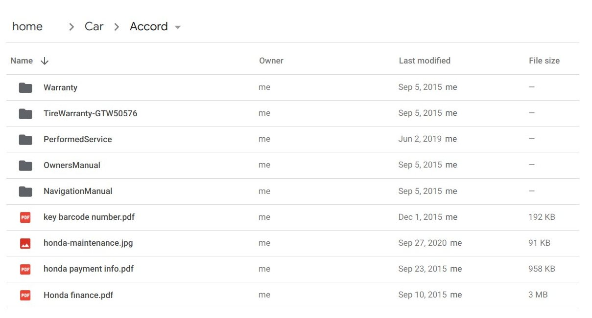
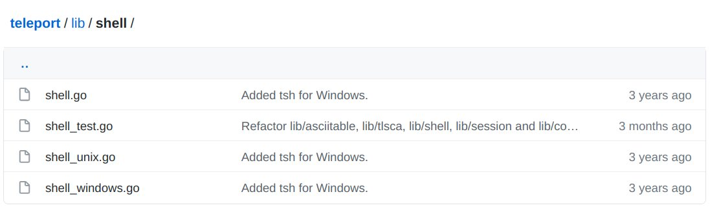

# Frontend Application Developer

## Summary

Implement an application that allows a user to browse directory content on a remote server.

## Rationale

We would like to evaluate your skill in the following areas:

* Taking existing high-level requirements and translating them to a functional application
* Writing production level code that does not depend on gigabytes of npm packages
* Communicating with the team when working on the challenge
* Handling feedback

We believe this technique is not only better but also more fun compared to
whiteboard/quiz interviews so common in the industry. It’s not without the
downsides - it could take longer than traditional interviews. That said, it's
our view that this type of challenge gives us a more accurate assessment of your
ability to work well on the types of projects we’re working on day-to-day here
at Teleport.
[Some of the best teams use coding challenges](https://sockpuppet.org/blog/2015/03/06/the-hiring-post/).
We appreciate your time and are looking forward to hacking on this project
together.

## Tools

* CSS: any
* Frontend: React, React Router
* Backend: NodeJS, Go, Rust
* Version Control: GitHub

## Levels

There are 6 engineering levels at Teleport. Levels 1-4 are open through the frontend challenge.

For frontend engineers, levels 5 and 6 are only for internal promotions. Check
the
[engineering levels document](https://raw.githubusercontent.com/gravitational/careers/main/levels.pdf)
for more details.

## Requirements

Implement an application that allows a user to browse directory content on a remote server.

This application should have the following functionality:

* A file/folder viewer with a client-side search and sorting capabilities.
* Authentication with a login screen and backend API to browse a directory.

### Level 1

This level focuses on JS/CSS/DOM knowledge and does not require any server-side knowledge to implement.

Create a directory viewer with the following functionality:

* Viewing and browsing of directory content.
* Viewing a file will show you metadata about the file (preview is not required).
* Sorting and filtering on all attributes within the current directory.

Directions:

*  Build your own components.
*  Display the `name`, `size`, and `type` file attributes.
*  Use human readable format to display the `size` of a file.
*  Use below JSON structure to mock real directory.

```js
const directory = {
  name: "teleport",
  sizeKb: 0,
  type: "dir",
  items: [
    {
      name: "lib",
      sizeKb: 0,
      type: "dir",
      items: [
        {
          name: "teleport.go",
          sizeKb: 320,
          type: "file",
        },
        {
          name: "test.go",
          sizeKb: 3320,
          type: "file",
        },
      ],
    },
    {
      name: "README.md",
      sizeKb: 4340,
      type: "file",
    },
  ],
};
```

You can use a design of similar viewers like Google Drive or Github as a
starting point and then add missing pieces to it. For example, you can borrow
CSS from these design systems:
[Github](https://primer.style/components/getting-started) or
[Google](https://material-ui.com/getting-started/usage/) if you like.




### Level 2

This level focuses on serving web assets. In addition to the Level 1
requirements, you will:

* Serve web assets from a web server.
* Containerize your application using Docker.
* Implement URL Naviation

Directions:

* You can use a basic server (like nginx) to serve web assets or write a small
  NodeJS/Go application to serve them.
* Ensure that the path of the directory/file being viewed is part of the URL.
  Refreshing the page should show the same state/content as before.

### Level 3

This level focuses on backend knowledge and a basic understanding of web security.
At this level, you'll implement the UI from the Level 2 challanege, and add a backend
with the following features:

* Implement an API that allows authenticated users to browse a server directory
  1-level deep at a time. Update the UI to use this API instead of a static JSON
  object.
* Add support for session management for login/logout.
* A login screen where an unauthenticated user is automatically redirected to
  (and then taken back to original URL).

Directions:

* You can store user sessions in the memory, no need to use a database.
* You can hardcode some parameters such as a directory location, or
  username/hash.
* Use native/standard libraries. Avoid using out-of-the-box solutions like
  passportjs, or lodash
* Use native browser APIs for networking.

### Level 4

This level focuses on the quality of the submission and a comprehensive
understanding of software security.

* Make sure your application is not vulnerable to any web security vulnerabilities.
* Make sure you have strong TLS setup.

# Guidance

## Interview process

The interview team joins the Slack channel. The team consists of the engineers
who will be working with you. Ask them about the engineering culture, work and
life balance, or anything else that you would like to learn about Teleport.

Before writing the actual code, create a brief design document and share with
the team. At Teleport, we prefer Markdown for
[our designs](https://github.com/gravitational/teleport/blob/master/rfd/0000-rfds.md).

This document should include proposed UX of the app (wireframes are great),
tools and libraries that will be used, proposed API, implementation details
where appropriate (for example: session management), and security.

A few notes about the design document:

* We expect the design document to be complete roughly within the first week.
  This is to ensure you have enough time to work on the implementation.
* Avoid writing an overly detailed design document. Two to three pages is
  sufficient.
* Avoid sending us draft design documents, it is difficult to evaluate what
  parts are draft and which parts are complete. Instead we encourage asking
  questions in Slack and sharing a design document that is ready to be
  reviewed.

Split your code submission using pull requests and give the team an opportunity
to review the PRs. A good “rule of thumb” to follow is that the final PR
submission is a formality adding a small feature set - it means that the team
had an opportunity to contribute the feedback during multiple well defined
stages of your work.

Our team will do their best to provide a high quality review of the submitted
pull requests in a reasonable time frame. You are spending your time on this, we
are going to contribute our time too.

After the final submission, the interview team will assemble and vote using +1,
-2 anonymous voting system: +1 is submitted whenever a team member accepts the
submission, -2 otherwise. In case of a positive result, we will connect you to
our HR and recruiting teams, who will work out the details and present an offer.

In case of a negative score result, the hiring manager will contact you and send
a list of key observations from the team that affected the result.

## Code and project ownership

This is a test challenge and we have no intent of using the code you’ve
submitted in production. This is your work, and you are free to do whatever you
feel is reasonable with it. In the scenario where you don’t pass, you can open
source it with any license and use it as a portfolio project.

## Areas of focus

These are the areas we will be evaluating in the submission:

* Use consistent coding style. We use the recommended
  [ESLint](https://eslint.org/docs/user-guide/configuring/configuration-files#using-eslintrecommended)
  and
  [eslint-plugin-react](https://github.com/yannickcr/eslint-plugin-react#configuration)
  rules for JS, and format our code with [prettier](https://prettier.io/).
* Create a few unit-tests for scenarios you think make sense.
* Make sure builds are reproducible. Pick any vendoring/packaging system that
  will allow us to get consistent build results.
* Ensure error handling and error reporting is consistent. The app should report
  clear errors and not crash under non-critical conditions.
* Ensure that your app is secure.

## Pitfalls and Gotchas

To help you out, we’ve composed a list of things that previously resulted in a no-pass from the interview team:

* Scope creep. Candidates have tried to implement too much and ran out of time.
* Avoid using unnecessary 3rd party dependencies.
* Error handling. We pay extra attention to error handling. Make sure that they
  are properly handled and not ignored.
* URL navigation is a big part of great UX, do not ignore it.
* Keep your CSS simple but not simpler. Do not waste your time on animations,
  instead make sure that an extra character does not destroy your layout.
* Make sure that your code is secured and your application is not vulnerable to
  common
  [web security vulnerabilities](https://cheatsheetseries.owasp.org/cheatsheets/Authentication_Cheat_Sheet.html).
  For a senior level, make sure you have a good crypto setup and secure session
  management.

## Scoring

We want to be as transparent as possible on how we will be scoring your
submission. You will be evaluated on the following criteria:

* The submitted code has a clear and modular structure.
* The candidate outlined the key design points in the design document.
* The code provides examples of tests covering key components.
* The code provides clear error handling and reporting.
* The app works according to the specifications, no bugs.
* The candidate demonstrates an ability to handle and apply feedback.
* The code is not vulnerable to common web security vulnerabilities.

## Questions

It is OK to ask the interview team questions. Some folks stay away from asking
questions to avoid appearing less experienced, so we provide examples of
questions to ask and questions we expect candidates to figure out on their own.

Here is a great question to ask:

> Is it OK to pre-generate secret data, like a password hash, and put it in the
> repository for a proof of concept? I will add a note that we will
> auto-generate secrets in the future.

It demonstrates that you thought about this problem domain, recognize the trade
off and are saving you and the team time by not implementing it.

This is the question we expect candidates to figure out on their own:

> What version of Go should I use? What dependency manager should I use?

Unless specified in the requirements, pick the solution that works best for you.

# Timing

You can split coding over a couple of weekdays or weekends and find time to ask questions and receive feedback.

Once you join the Slack channel, you have 2 weeks complete the challenge.

Within this timeframe, we don't give higher scores to challenges submitted more
quickly. We only evaluate the quality of the submission.

We only start the coding challenge if there are several open positions available.
