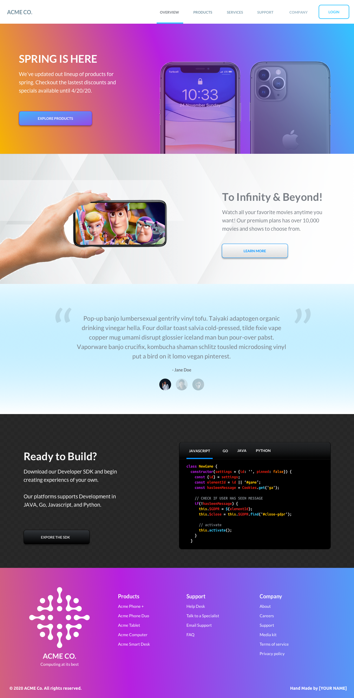
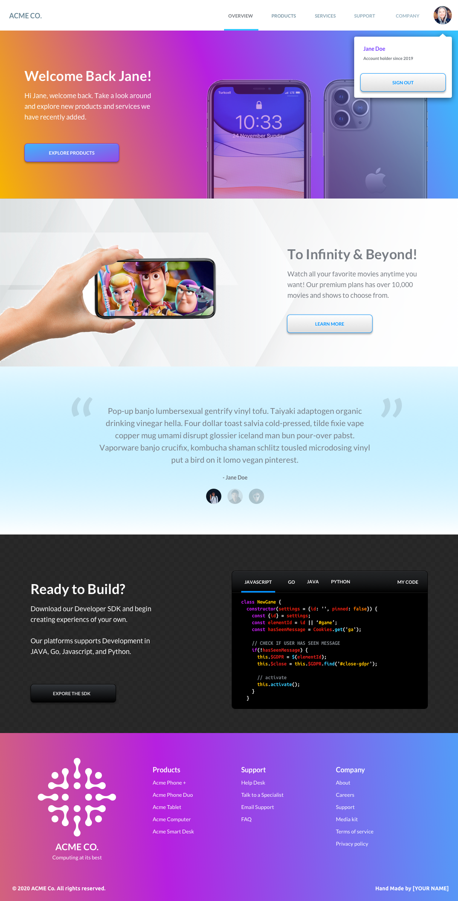
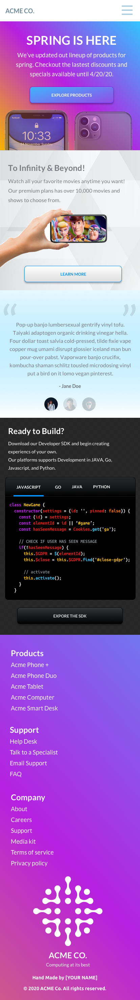

# Frontend Challenge

## Summary

Create a fictitious website using the Next.js framework and the designs provided by the client. 

## Rationale
We would like to evaluate your skill in the following ares: 
- Taking existing designs and translating them to fully functional web presences. 
- Writing production level code for the client and server
- Communicating with team when working on the challenge 
- Handling feedback from Teleport employees

We believe this technique is not only better, but also is more fun compared to whiteboard/quiz interviews so common in the industry. It’s not without the downsides - it could take longer than traditional interviews. [Some of the best teams use coding challenges](https://sockpuppet.org/blog/2015/03/06/the-hiring-post/). We appreciate your time and are looking forward to hack on this project together.

## Tools
- Backend - Node.js
- Frontend - Typescript and React, Style Components
- Framework - Next.js
- Version Control - Github

## Requirements
There are 6 engineering levels at Teleport. It’s possible to score on level 1-5 through coding challenges. Level 6 is only for internal promotions. Check the engineering levels document for more details.

Split the submission in 2-3 pull requests (one for each level of the test) for us to review. We will review every pull request and provide our feedback.

# Directions

You can find images for the challenge in **assets** folder along with the **Sketch** file used to create the design. 

## Level 1 - Next.js setup with typescript and basic page layout
- Create Next.js instance
- Use typescript
- Create React components for sections of the webpage, you do not need to style these components but the markup should be well thought out. 
- Use yarn to setup the build process 
- Provide documentation on how to get it running locally 

## Level 2 - Create styles for these components
- Use react [styled components](https://styled-components.com/) to style the existing components you have created
- Make sure your styles are responsive for differnt screen sizes (see mobile screen shot in images folder)
- Add functionality for dropdown menu
- Create a unit test for the dropdown menu
- 

## Level 3-4 - Responsive styling and unit testing, server side rendering
- Add functionality for code box widget 
- Add Authentication using github for signing in
- Update the navigation and component, hero image, and cod box when the user is authenticated 
- Provide unit tests for: github authentication, dynamically changing elements during when authed, and the codebox widget.  

# Guidance

## Interview process
The interview team joins the slack channel. The team consists of the engineers who will be working with you. Ask them about the engineering culture, work and life balance, or anything else that you would like to learn about Teleport.

Split your code submission using pull requests and give the team an opportunity to review the PRs. A good “rule of thumb” to follow is that the final PR submission is a formality adding a small feature set - it means that the team had an opportunity to contribute the feedback during multiple well defined stages of your work.

Our team will do their best to provide a high quality review of the submitted pull requests in a reasonable time frame. You are spending your time on this, we are going to contribute our time too.

After the final submission, the interview team will assemble and vote using +1, -2 anonymous voting system: +1 is submitted whenever a team member accepts the submission, -2 otherwise.
In case of a positive result, we will connect you to our HR team who will collect one-two references and will work out other details. You can start the reference collection process in parallel if you would like to speed up the process.

After reference collection, our ops team will send you an offer.
In case of a negative score result, the hiring manager will contact you and send a list of the key observations from the team that affected the result.

## Code and project ownership
This is a test challenge and we have no intent of using the code you’ve submitted in production. This is your work, and you are free to do whatever you feel is reasonable with it. In the scenario when you don’t pass, you can open source it with any license and use it as a portfolio project.

## Areas of focus
Teleport focuses on networking, infrastructure and security. These are the areas we will be evaluating in the submission:

- Use consistent coding style. We follow [Golang Coding Style](https://github.com/golang/go/wiki/CodeReviewComments) for the Go language and [AirBnB Coding Style](https://github.com/airbnb/javascript) for the JS language. If you are going to use a different language, please pick coding style guidelines and let us know what they are.
- Create one test for an unhappy scenario.
- Make sure builds are reproducible. Pick any vendoring/packaging system that will allow us to get consistent build results.
- Ensure error handling and error reporting is consistent. The system should report clear errors and not crash under non-critical conditions.

## Scoring 

We want to be as transparent as possible on how we will be scoring your submission. The following table provides a description of different areas you will be evaluated on and how they will affect your overall score.

| Description                                                                                                          | Possible Points Awarded | Possible Points Subtracted |
|----------------------------------------------------------------------------------------------------------------------|-------------------------|----------------------------|
| The submitted code has a clear and modular structure. Code should be easy to read and include comments when helpful. | +1                      | -1                         |
| The candidate communicated their progress during the interview                                                       | +1                      | -1                         |
| README provides clear instructions                                                                                   | +1                      | -1                         |
| The code provides examples of tests covering key components                                                          | +1                      | -1                         |
| The website works according to the specifications                                                                    | +1                      | -1                         |
| The implementation of the design is accurate based on specs provided                                                 | +1                      | -1                         |
| The website is responsive to various screen sizes and devices                                                        | +1                      | -1                         |
| The interactive components function properly and as expected.                                                        | +1                      | -1                         |
| The candidate demonstrates ability to handle and apply feedback                                                      | +1                      | -1                         |
| The application can be used on a server (not just static rendering, requested pages on the fly)                      | +1                      | -1                         |