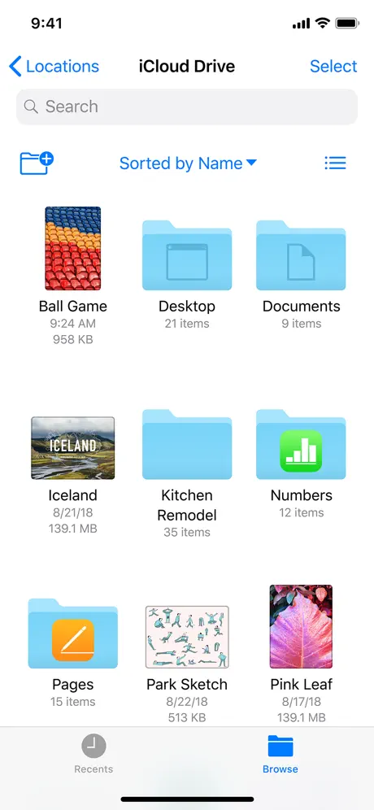
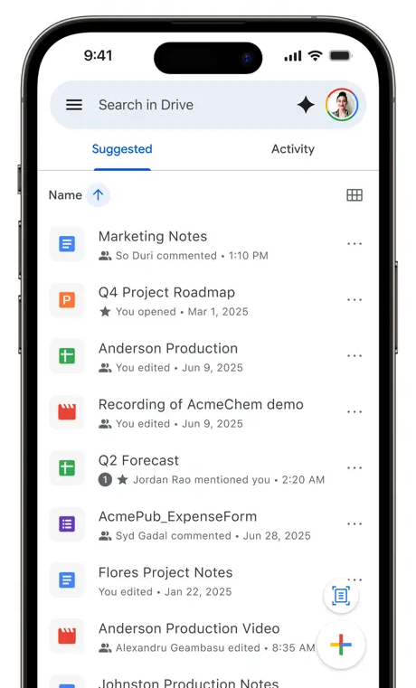

# Mobile Application Developer

Welcome!

We will use this project in order to evaluate your skill in the following areas:

* Taking existing high-level requirements and translating them to a functional
  application
* Writing production level code that does not depend on gigabytes of npm
  packages
* Communicating with the team when working on the challenge
* Handling feedback

We believe this technique is not only better but also more fun compared to
whiteboard/quiz interviews so common in the industry. It's not without the
downsides - it could take longer than traditional interviews. That said, it's
our view that this type of challenge gives us a more accurate assessment of your
ability to work well on the types of projects we're working on day-to-day here
at Teleport. [Some of the best teams use coding
challenges](https://sockpuppet.org/blog/2015/03/06/the-hiring-post/). We
appreciate your time and are looking forward to hacking on this project
together.

## Summary

In this challenge, you will build a mobile app that allows a user to browse
directory content on a remote server. Think Google Drive, Files, or Dropbox.

|  |  |
| --- | --- |

When you are ready to begin, we will invite you to a GitHub repository where you
will collaborate with a few members of the team on the challenge.

## Tools

In order to provide an experience similar to working on Teleport itself, we've
selected tools that align with our internal development environment.

* Version control and code review performed via GitHub
* The backend API is written in Go
* The UI is an iOS app written in Swift

## Levels

There are 6 engineering levels at Teleport. Levels 1-4 are open to external candidates.

For mobile engineers, levels 5 and 6 are only for internal promotions. Check
[Fullstack Engineering Levels](../../levels/fullstack.pdf) for more details.

## Requirements - Level 4

Implement an iOS application that allows a user to browse directory content on a
remote server.

This application should have the following functionality:

* A Go backend that serves the API
* The UI, which should include client-side filtering and sorting capabilities
* Strong authentication

Additionally, we are a security-focused company and place an extra emphasis on
security for senior engineering candidates. We will expect your solution to have
a strong security posture as it pertains to authentication, encryption, and
overall security.

### API

For the purposes of this project, the API can return simulated or hard-coded data.
It is not necessary to actually read from the filesystem.

Your API only needs to return the contents of the specified directory and does
not need to recurse into subdirectories. The following is an example of an
acceptable API response:

```json
{
  "name": "example",
  "type": "dir",
  "size": 0,

  "contents": [
    {
      "name": "README.md",
      "type": "file",
      "size": 12345,
    },
    {
      "name": "images",
      "type": "dir",
      "size": 0,
    }
  ]
}
```

When you add authentication (the requirements for which are outlined later in
this document), the API will also need to support session management (logging in
and out).

### UI

The UI should allow a user to view the contents of a single directory. Clicking
on a subdirectory should navigate to that directory and refresh the contents.
Unlike other commercial tools, _file preview is not required_. Clicking on a
file should not do anything.

The following features are required:

* [ ] Display the filename, type (file or directory), and human-readable size for files.
* [ ] Add support for filtering the directory contents based on filename.
  Filtering should be performed client-side, and a simple substring match is
  sufficient.
* [ ] Add support for sorting directory contents based on filename, type, and
  size.
* [ ] Include breadcrumbs that show the current location in the directory. The
  breadcrumbs should be clickable for easy navigation to parent directories.
* [ ] Ensure that your app correctly displays loading and error states.

### Authentication

The app should also present directory information only to authenticated users.

The following features are required:

* [ ] The API should reject requests from unauthenticated users
* [ ] The UI should provide a way for users to log out.

User sessions can be stored in memory, there is no need for a database of any
kind.

User registration / enrollment is not required. You are welcome to hard-code one
or two valid users, just let us know what their credentials are for testing
purposes.

Please do not use a third party solution that provides authentication out of
the box.

# Guidance

## Interview process

The interview team joins the Slack channel. The team consists of the engineers
who will be working with you. Ask them about the engineering culture, work and
life balance, or anything else that you would like to learn about Teleport.

### Design Document

Successful engineers at Teleport have great written communication skills. You
will get a chance to demonstrate these skills before sending us any code by
writing a design document. At Teleport, we prefer Markdown for
[our designs](https://github.com/gravitational/teleport/blob/master/rfd/0000-rfds.md).

Your design document should include:

- the proposed UX of the app (wireframes are great!)
- an overview of your backend API
- an overview of authentication and how the login process will work
- implementation details where appropriate (for example, session management)

A few notes about the design document:

* We expect the design document to be complete roughly within the first week.
  This is to ensure you have enough time to work on the implementation.
* Avoid writing an overly detailed design document. Two to three pages is
  sufficient.
* Avoid sending us draft design documents, it is difficult to evaluate what
  parts are draft and which parts are complete. Instead we encourage asking
  questions in Slack and sharing a design document that is ready to be
  reviewed.
* When you feel it's ready, create a PR for this document to allow the team to
  review and comment on it.

Once you've received 2 approvals, you can merge the PR and start sending us code.

### Implementation

Split your code submission into a series of pull requests that are easy for the
team to review in a single sitting. A good “rule of thumb” is to aim to complete
the project in 3-4 PRs.

Our team will do their best to provide a high quality review of the submitted
pull requests in a reasonable time frame. You are spending your time on this, we
are going to contribute our time too.

After the final submission, the interview team will assemble and vote using +1,
-2 anonymous voting system: +1 is submitted whenever a team member accepts the
submission, -2 otherwise. In case of a positive result, we will connect you to
our HR and recruiting teams, who will work out the details and present an offer.

In case of a negative score result, the hiring manager will contact you and send
a list of key observations from the team that affected the result.

## Code and project ownership

This is a test challenge and we have no intent of using the code you've
submitted in production. This is your work, and you are free to do whatever you
feel is reasonable with it. In the scenario where you don't pass, you can open
source it with any license and use it as a portfolio project.

## Areas of focus

These are the areas we will be evaluating in the submission:

* Use consistent coding style.
* Create a few unit-tests for scenarios you think make sense.
* Make sure builds are reproducible and provide instructions on how to run your app. Pick any
  vendoring/packaging system that will allow us to get consistent build results.
* Ensure error handling and error reporting is consistent. The app should report
  clear errors and not crash under non-critical conditions.
* Ensure that your app is secure.

The primary factor in the team's decision is overall code quality. We are looking for
the highest possible quality with the smallest possible scope that meets the requirements
of the challenge.

## Pitfalls and Gotchas

To help you out, we've composed a list of things that previously resulted in a
no-pass from the interview team:

* Use of AI. Don't outsource your thinking to an AI. We recommend using AI for
  use cases like learning about a new problem space, exploring APIs, and
  finding missing edge cases. However, we strongly recommend you write
  the design document and all code yourself.
* Scope creep. Candidates have tried to implement too much and ran out of time.
   * Avoid implementing an overly complex solution just to show that you are
     capable of writing a complex feature. Instead, if you think something could
     be made more complex in a full-fledged app, leave a comment about it and
     move on with a solution which solves the problem at hand.
   * For example, there is no need to implement a pluggable auth system which in
     the future would let you easily switch between different auth methods. It
     is better to focus on implementing a single auth method.
* Error handling. We pay extra attention to error handling. Make sure that they
  are properly handled and not ignored.
* Keep your UI simple. The app does not have to be pretty but it has to feel
  nice to use on mobile phones. The layout does not need to support iPads.
* Make sure that your code is secured and your application is not vulnerable to
  common security vulnerabilities.
    * Recommended resources:
        * [OWASP Mobile Application Security](https://mas.owasp.org/)
* For a senior level, make sure you have a good crypto setup and secure session
  management.

## Scoring

We want to be as transparent as possible on how we will be scoring your
submission. You will be evaluated on the following criteria:

* The submitted code has a clear and modular structure.
* The candidate outlined the key design points in the design document.
* The code provides examples of tests covering key components.
* The code provides clear error handling and reporting.
* The app works according to the specifications, no bugs.
* The candidate demonstrates an ability to handle and apply feedback.
* The code is not vulnerable to common web security vulnerabilities.

## Questions

It is OK to ask the interview team questions. Some folks stay away from asking
questions to avoid appearing less experienced, so we provide examples of
questions to ask and questions we expect candidates to figure out on their own.

Here is a great question to ask:

> Is it OK to pre-generate secret data, like a password hash, and put it in the
> repository for a proof of concept? I will add a note that we will
> auto-generate secrets in the future.

It demonstrates that you thought about this problem domain, recognize the trade
off and are saving you and the team time by not implementing it.

This is the question we expect candidates to figure out on their own:

> What version of Go should I use? What dependency manager should I use?

Unless specified in the requirements, pick the solution that works best for you.

## Timing

You can split coding over a couple of weekdays or weekends and find time to ask
questions and receive feedback.

Once you join the Slack channel, you have 2 weeks complete the challenge.

Within this time frame, we don't give higher scores to challenges submitted more
quickly. We only evaluate the quality of the submission.

We always aim to provide 1-2 rounds of feedback on all work that is submitted.
In order to be respectful of your time, we may opt to end the challenge early
if the submission does not improve after this feedback is suggested or if we
identify a large number of issues.
