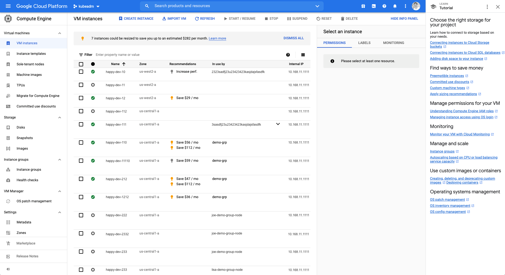

# Product Design Challenge

## Objective
The goal of the Product Designer challenge is to redesign the Google cloud platform “Compute Engine” [page for VM instances](https://console.cloud.google.com/compute/instances) (see image above). and improve the overall user experience. You will be tasked with taking the current page and creating a beautiful easy to use version of it with well thought out design thinking. 

You will be expected to defend your decision making process and explain why these changes helped to improve the product and overall user experience. There are a number of design solutions that would likely work for this example, the thinking behind your decision making will be the key to success on this challenge. 

## Instructions

1. You will be redesigning the Google cloud platform “Compute Engine” page for VM instances (see attached image).. You should be able to use google cloud for free even if you do not have any instances. This may give you more understanding of the UI and benefit your design decisions. 
2. You should make improvements to the usability of the page and use of existing real estate. Keep in mind that there are thousands of instances or even tens of thousands, make sure a user can successfully navigate through them with the changes you make. 
3. You should create three versions of this page (3 states). One state with the servers running normally. A blank state (no servers present, first time user), and an error state when servers start to fail. 
4. You should maintain the existing brand colors for the application. However you should take liberties to improve all areas of design for this application including (but not limited to) the layout of all components on the page. 
5. You can use any design program you choose (sketch, figma, photoshop, mspaint :P) 
6. You should pay attention to the current features and make sure you do not remove or forget to put them in place. 
7. You should create a list of items you felt like were issues and explain what you did to solve them 
8. The test will take approximately 4+ hours to complete and you will be given a maximum of two weeks to finish. 

## Scoring
We want to be as transparent as possible on how we will be scoring your test. The following table provides a description of different areas you will be evaluated on and how they will affect your overall score.

| Description                                                                                                     | Possible Points Awarded | Possible Points Subtracted |
|-----------------------------------------------------------------------------------------------------------------|-------------------------|----------------------------|
| Application States (ex. first time experience, errors, etc)                                                     | +1                      | -1                         |
| Interaction Design, the application design patterns used to complete the challenge                              | +1                      | -1                         |
| Navigation and toolbars within the application                                                                  | +1                      | -1                         |
| Branding consistency                                                                                            | +1                      | -1                         |
| Usability improvements. You must defend why this is more usable for customers                                   | +1                      | -1                         |
| Layout and negative space. Being thoughtful about the location of elements and their proximity to other items.  | +1                      | -1                         |
| Typography - Your selection of typographical styles                                                             | +1                      | -1                         |
| The candidate demonstrates ability to communicate with the team during the process                              | +1                      | -1                         |
| Creativity - Your ability to innovate on the existing design and find out of the box improvements               | +1                      | -1                         |