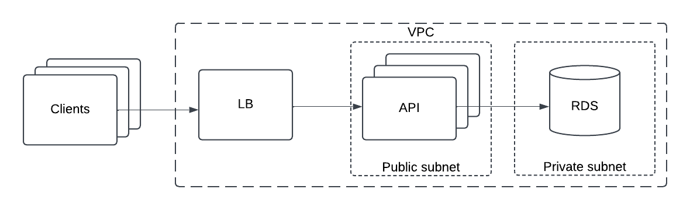

# SRE - Security

The interview process is divided into two main sections: a walkthrough and a challenge. In the walkthrough, led by the hiring manager, you’ll have an opportunity to share your work history, review our leveling matrix, and discuss the upcoming challenge. Following the walkthrough, the challenge will assess your skills and fit for this position.

We will use the challenge in order to evaluate your skill in the following areas:
* Translating high-level requirements into a simple, functional design.
* Writing production level code that does not have extensive or insecure dependencies.
* Understanding of Go, Kubernetes, release engineering, and security.
* Communicating with the team and handling feedback.

We believe this technique is not only better but also more fun compared to
whiteboard/quiz interviews so common in the industry. It’s not without the
downsides - it could take longer than traditional interviews. That said, it's
our view that this type of challenge gives us a more accurate assessment of your
ability to work well on the types of projects we’re working on day-to-day here
at Teleport. [Some of the best teams use coding
challenges](https://sockpuppet.org/blog/2015/03/06/the-hiring-post/). We
appreciate your time and are looking forward to hacking on this project
together.

Please come prepared to the walkthrough having reviewed:
* [Site Reliability Engineering (SRE) Levels](../../levels/sre.pdf)
* [Challenge documentation](../sre-security/challenge.md)

# Challenge

In this challenge, you will create a Go server that interacts with a Kubernetes cluster, incorporating automated builds, containerization, testing, and a threat model.

## Getting Started

First, create a new private GitHub repository, invite the interview panel as contributors, and share the link with the team in Slack.

> [!IMPORTANT]
> You’ll have up to 2 weeks from the agreed start date to complete the challenge. Please allow 24-48 hours for each PR submission to give the team ample time for review and feedback during business hours.

### PR Submissions
The repository you created be used for each PR submission during the challenge.  For each submission, please ensure the following:

* Your submissions meets the requirements of the level you are applying for.
* Split the work into ~3 pull requests: one for the design document, one for the server code, and one covering security.
* After submitting, the team will review and provide feedback. Open one PR at a time and wait for two approvals before proceeding with submitting another. You can continue working locally while waiting for feedback on the current PR.

## Design Doc
The first pull request must be a brief design document that describes how you plan to implement the solution. At Teleport, we prefer Markdown for [our designs](https://github.com/gravitational/teleport/blob/master/rfd/0000-rfds.md).

### Requirements

Please be sure to cover the following design topics:
* API structure
* Developer workflow
  * Ease of contributing to the project from a fresh clone
  * Ease of building, running and testing the server
* Build, caching, and mTLS
* RBAC and network policy
* Level 5+: Reconciliation and Conflicts

> [!NOTE]
> Threat model documentation does not need to be included in the initial design doc but should be included with the final PR.

### Suggestions
* Complete the design document within the first week.  This is to ensure you have enough time to work on implementation.
* Avoid writing an overly detailed design document. 500-1500 words is a good target.
* We encourage you to ask questions in Slack.
* Avoid sending draft PRs for feedback as it is difficult to evaluate which parts are draft or complete.

## Server & Security
Once the design document is approved, the next PR should include your server implementation, along with build automation to simplify testing. The interview panel will clone the repository and run Make targets to build and test your server code. Be sure to include a couple of high-quality tests that cover both happy and unhappy scenarios, and minimize external dependencies.

> [!NOTE]
> For level 4+, please research Kubernetes controllers and the recommended Go client libraries carefully. Understanding how controllers cache resources is key to implementing a straightforward solution.

After the server code is reviewed, submit a final PR that includes the remaining security and [threat model](#threat-model) criteria.  Since the threat model portion is a contrived example, it's okay to make some assumptions about architecture.  Please make sure to document these assumptions to help clarify your perspective.  The threat model document should contain sections on: attack vectors, risk, countermeasures, and trade-offs.  We will be assessing your ability to identify platform risks or patterns of abuse and the steps needed to mitigate or minimize the behavior.  Include enough detail to demonstrate your understanding, a good target is 100-300 words per section.

After completing the server code, submit a final PR that incorporates the remaining security and threat model criteria. Since the [threat model](#threat-model) example provided is hypothetical, you are encouraged to make reasonable assumptions about the system’s architecture. Be sure to clearly document these assumptions to provide context for your approach.

Your threat model document should include the following sections:

* Attack Vectors: Identify potential entry points for malicious actors.
* Risk Assessment: Evaluate the likelihood and impact of each threat.
* Countermeasures: Propose strategies to mitigate identified risks.
* Trade-offs: Discuss any limitations or end-user impact in your approach.

We will evaluate your ability to identify platform vulnerabilities, recognize patterns of misuse, and propose effective mitigation strategies. Aim for clear, concise, and detailed explanations, with each section containing approximately 100-300 words to demonstrate your understanding.

A key aspect of this challenge is to produce a self-contained GitHub project that automates as much as possible, including build artifacts, code testing, and deployment.

### Tooling
For evaluation purposes, your solution should be written in Go and is deployable to a local Kubernetes cluster. The choice of which local Kubernetes cluster is up to you, but please ensure compatibility with both macOS and Linux. We suggest [KIND](https://kind.sigs.k8s.io/).

You may use additional external dependencies, but ensure that detecting or installing these are straightforward for the reviewer. At a minimum, your solution should include the following dependencies:

* Go
* make
* Docker

## Level 4

### Server

* HTTP API to retrieve the replica count of the Kubernetes Deployment
* HTTP API to set the replica count of the Kubernetes Deployment
* HTTP API to get the list of available Deployments in the Kubernetes cluster
* HTTP health check verifying Kubernetes connectivity
* HTTP API must cache the replica count by watching for changes to Deployments.
  Read-only requests should not each trigger a request to the cluster.
  It is acceptable to use either client-go or controller-runtime to implement this.
* Secure connections between the HTTP API and caller with mTLS
* One or two tests that cover happy and unhappy scenarios
* Ability to build and deploy all artifacts to a Kubernetes cluster using make

### Security
* Create a service account for the API and limit access to only read/list secrets and configmap resources.
* Create a network policy that limits egress from your API service to only that which is needed.
* Create a document that outlines the requirements in the [threat model](#threat-model) section.

## Level 5

### Server

* gRPC API to retrieve the replica count of the Kubernetes Deployment
* gRPC API to set the replica count of the Kubernetes Deployment
* gRPC API to get the list of available Deployments in the Kubernetes cluster
* gRPC or HTTP health check verifying Kubernetes connectivity
* gRPC API must cache the replica count by watching for changes to Deployments.
  Read-only requests should not each trigger a request to the cluster.
  It is acceptable to use either client-go or controller-runtime to implement this.
* Secure connections between the gRPC API and caller with mTLS
* Server must store the desired state in a CRD (per-deployment) and reconcile the deployment to that state. (gRPC API endpoints only need to read the real, current value.)
* One or two tests that cover happy and unhappy scenarios
* Ability to build and deploy all artifacts to a Kubernetes cluster using make

### Security
* Create a service account for the API and limit access to only read secrets and configmap resources.
* Create a network policy that limits egress from your API service to only that which is needed.
* Create a document that outlines the requirements in the [threat model](#threat-model) section.

## Threat Model
Imagine your API has matured into a public facing service and has been extended to include additional API endpoints that may return sensitive data. The service authenticates users via an API token, exposes the endpoint over a network load balancer that terminates TLS at the LB, and writes data to an externally managed database (see example diagram).  

* Develop a simple threat model for your service that identifies 3-4 vectors of attack and explain the risk.
* Explain countermeasures that could be implemented to mitigate risk.
* Explain any tradeoffs or behavior changes that could be expected by end users or clients of the API.

> [!IMPORTANT]
> Choose attack vectors that you believe contain the highest risk of compromise.



# Guidance

## Areas of focus

The primary factor in the team's decision is overall code quality. We are looking for the highest possible quality with the smallest possible scope that meets the requirements of the challenge.

* Use consistent coding style. Internally we follow [Go Coding Style](https://github.com/golang/go/wiki/CodeReviewComments).
* Make sure builds are reproducible and allow consistent build results.
* Ensure error handling and error reporting is consistent. The system should report clear errors and not crash under non-critical conditions.
* Production readiness. Once completed, the code itself, even if incomplete, should be sufficiently solid and robust to make it to a real production cluster.
* API design. Please include your proposed HTTP API or gRPC API in the design doc. For the gRPC API, you should include a complete proto file in the design doc.
* Security. Describe your mTLS setup in the design doc, including chosen cipher suites. Ensure that your implementation is secure. Also, when developing the threat model, consider which attack vectors are the riskiest or most impactful.
* Project management and scope. Manage your time wisely and ensure that the project scope aligns with the criteria for the level you're applying for. Avoid unnecessary complexity.

## Trade-offs
Write as little code as possible to avoid letting the project consume too much time, which can impact code quality. Cut corners where appropriate; for example, avoid complex configuration and use hardcoded values. Add TODO items to indicate future enhancements or considerations, such as:

```
  // TODO: Add configuration system.
  // environment variables and reasonable default values,
  // for example https://github.com/alecthomas/kingpin
  // TODO: Add retry logic
```

Comments like this one are really helpful. They save yourself time and demonstrate that you've spent time thinking about this problem and provide a clear path toward a longer-term solution.

Consider making other reasonable trade-offs. Make sure you communicate them to the interview team.

### Pitfalls and Gotchas
To help you out, we've composed a list of things that previously resulted in a no-pass from the interview team:

* Scope creep. Candidates have tried to implement too much and ran out of time
  and energy. To avoid this pitfall, use the simplest solution that will work.
  Avoid writing too much code. For example, it is not necessary to deploy a shared cached or support deployment to multiple regions or AZs.
* Overly complex designs. Keep things simple and try and eliminate as many moving
  parts as possible. This is not only going to help in reviewing the solution,
  but is also often a way to distill a design to its essential parts.
* Unstructured code. We've seen candidates leaving commented chunks of code,
  having one large file with all the code, not having code structure at all.
* Not communicating. Some candidates have submitted all their code to the master
  branch without raising pull requests, which does not give us the ability to
  provide feedback on the various implementation phases. We are a distributed
  team, so structured, asynchronous communication is critical to us.

## Questions

It is OK to ask the interview team questions. Some folks stay away from asking
questions to avoid appearing less experienced, so we provide examples of
questions to ask and questions we expect candidates to figure out on their own.

Here is a great question to ask:

> Is it OK to assume there will be only a single target kubernetes cluster for
this service? I will add a note on how support for multiple clusters could be
implemented, but it feels like an unnecessary complexity.

This is the question we expect candidates to figure out on their own:

> What version of Go should I use? What dependency manager should I use? What
framework/tool should I use to automate testing and deployment ?

Unless specified in the requirements, pick the solution that works best for you.

## Code and project ownership

This is a test challenge, and we have no intention of using the code in production. The work is yours, and you’re free to handle it as you see fit. If you don’t pass, you’re welcome to open-source it under any license and use it as a portfolio project.
